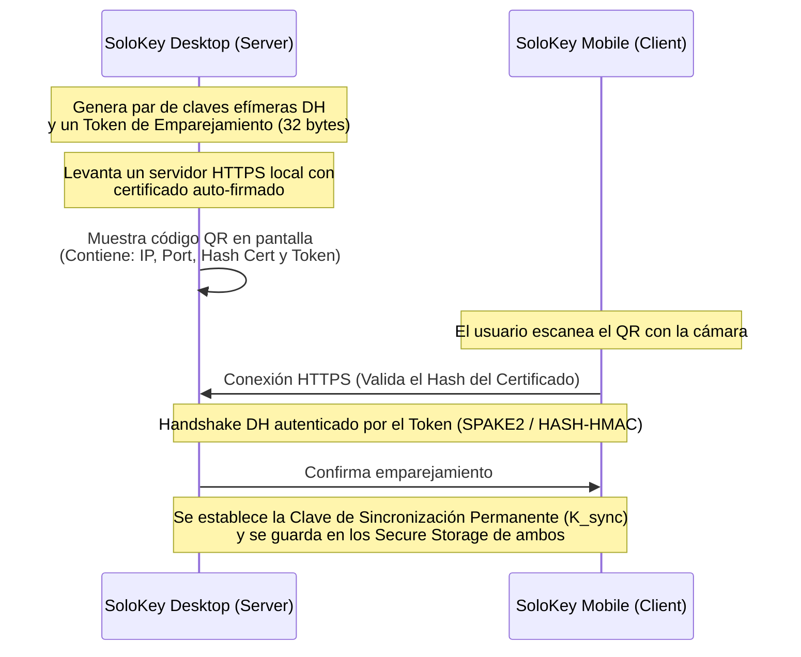

# 🖥️ SoloKey Desktop Companion — Plan de Arquitectura y Planificación

Este documento establece el diseño técnico, protocolos criptográficos y estrategia de sincronización local para la aplicación de escritorio de **SoloKey** (Windows/macOS/Linux) en complementariedad con la aplicación móvil.

---

## 🏗️ 1. Arquitectura General y Stack Tecnológico

Siguiendo la filosofía **Local-First** y el ecosistema de SoloKey, la aplicación de escritorio se construirá con las siguientes bases:

*   **Framework:** **Flutter for Desktop** (Dart). Esto permite reutilizar el 85%+ de la lógica de negocio (Clean Architecture), los modelos inmutables (`Freezed`), la base de datos (`Drift` sobre SQLite nativo), los servicios criptográficos (`cryptography`) y la inyección de dependencias (`injectable`).
*   **Base de Datos Local:** Cada instancia de escritorio tendrá su propia base de datos Drift cifrada de forma independiente utilizando una clave local generada por el sistema operativo (vía `Credential Manager` en Windows, `Keychain` en macOS y `Secret Service` en Linux).
*   **Comunicación P2P:** La sincronización y comunicación móvil-escritorio se realizará **exclusivamente a través de la red local (LAN/Wi-Fi)** sin depender de servidores en la nube centralizados, manteniendo la privacidad absoluta de los datos.

---

## 🔒 2. Protocolo de Emparejamiento Seguro (Pairing Key Exchange)

Para establecer confianza entre el dispositivo móvil y la aplicación de escritorio, se utilizará un flujo de emparejamiento mediante **códigos QR** que realiza un intercambio de claves autenticado:

### Detalle del Flujo de Emparejamiento:
1.  **Activación de Emparejamiento:** El usuario selecciona "Conectar dispositivo" en el escritorio.
2.  **QR Code Payload:** El escritorio muestra un QR que contiene un JSON serializado con:
    *   `ip`: Dirección IP local (LAN) y puerto (ej. `192.168.1.45:8283`).
    *   `cert_fingerprint`: Hash SHA-256 del certificado TLS autogenerado por el escritorio. Esto evita ataques Man-in-the-Middle (MitM) en redes Wi-Fi locales/públicas.
    *   `pairing_token`: Clave de un solo uso con alta entropía generada aleatoriamente (256-bit).
3.  **Conexión Segura Directa:** El móvil escanea el QR, extrae los datos, y establece una conexión HTTPS/WSS (WebSockets sobre TLS) directa a la IP indicada. Durante el handshake TLS, el móvil valida que el certificado remoto coincida exactamente con el `cert_fingerprint` escaneado.
4.  **Confirmación Mutua:** Ambas partes realizan un desafío criptográfico usando el `pairing_token` para derivar una clave compartida permanente de sincronización (`K_sync`). Esta clave se guarda permanentemente en la base segura de cada dispositivo (`flutter_secure_storage`).

---

## 🔄 3. Protocolo de Sincronización Incremental (Delta-Sync)

La sincronización utiliza un modelo **Local-First conflict-free** basado en marcas de tiempo y vectores de versión para sincronizar los datos de la bóveda sin exponer las contraseñas en claro.

### Datos Sincronizados
Todos los datos que se transfieren viajan en un payload JSON cifrado de extremo a extremo utilizando **AES-256-GCM** con la clave de sincronización (`K_sync`). El canal TLS local añade una capa adicional de transporte cifrado (doble cifrado).

### Proceso de Sincronización (Paso a Paso):
1.  **Solicitud de Sync:** Cuando ambos dispositivos están en la misma red y encendidos, el móvil se conecta al WebSocket del escritorio.
2.  **Intercambio de Metadatos (Handshake de Estado):**
    *   Ambos dispositivos envían una lista compacta de metadatos: `(id, version_counter, updated_at)` para todas las credenciales y carpetas.
3.  **Cálculo del Delta:**
    *   Cada dispositivo compara la lista recibida con su estado local.
    *   Si un ID no existe localmente, o si el `version_counter` remoto es mayor, se añade a la lista de "solicitados".
    *   Si el `version_counter` local es mayor que el remoto, se añade a la lista de "enviar".
4.  **Resolución de Conflictos:**
    *   Si un mismo ID tiene cambios en ambos lados con diferentes valores y marcas de tiempo, se utiliza la política de **Last-Write-Wins (LWW)** basada en `updated_at`.
    *   Para evitar pérdida accidental de datos, el historial de contraseñas (`PasswordHistory`) se combina de forma aditiva, por lo que nunca se pierden las contraseñas anteriores.
5.  **Envío de Payloads:**
    *   Los dispositivos intercambian los payloads cifrados correspondientes a los deltas.
    *   Cada dispositivo descifra e inserta/actualiza las entidades en su base de datos Drift local de forma atómica dentro de una transacción SQLite.

---

## 📱 4. Desbloqueo Remoto (Auto-Unlock via Mobile)

Para maximizar la comodidad del usuario sin comprometer la seguridad (evitando escribir la contraseña maestra larga en el teclado de la PC continuamente):

1.  **Petición de Desbloqueo:** El usuario abre SoloKey Desktop. Si está emparejado con el móvil, el escritorio muestra una opción: "Desbloquear desde el móvil".
2.  **Notificación Push Local:** El escritorio envía una solicitud cifrada mediante el WebSocket al móvil.
3.  **Biometría Móvil:** El móvil vibra y muestra un prompt biométrico: "¿Desbloquear SoloKey Desktop?".
4.  **Transmisión de Master Key:**
    *   Una vez que el usuario autentica con su huella/rostro en el móvil, el móvil recupera temporalmente la clave maestra AES de la bóveda en memoria RAM.
    *   El móvil cifra esta clave maestra AES con la clave compartida `K_sync` usando AES-256-GCM (añadiendo un timestamp para prevenir ataques de replay de máximo 10 segundos).
    *   Envía el blob cifrado al escritorio.
5.  **Desbloqueo en Escritorio:** El escritorio descifra el blob con su copia de `K_sync`, verifica la frescura del timestamp, carga la clave maestra en su propio `SessionManager` en RAM, y da acceso a la bóveda local sin haber almacenado la contraseña maestra en el disco de la PC.

---

## 🛠️ 5. Plan de Fases de Implementación

Para asegurar un desarrollo incremental controlado, se propone dividir el desarrollo en 3 fases:

### Fase 1: Core de Escritorio Local (Independiente)
*   Habilitar compilación de Flutter para Desktop (Windows/macOS) en el repositorio actual.
*   Configurar persistencia con Drift (SQLite) en directorios locales seguros (`AppData` / `Application Support`).
*   Implementar integración nativa con el almacenamiento de claves seguro del SO para resguardar la sal y la clave local.
*   Importar las pantallas de Login, Desbloqueo y Formulario adaptadas a layouts responsivos (Master-Detail).

### Fase 2: Conectividad y Protocolo P2P
*   Implementar servidor HTTPS y WebSocket local embebido en la app de Escritorio.
*   Implementar flujo de generación y escaneo de códigos QR para emparejamiento seguro.
*   Implementar el intercambio criptográfico DH y derivación de `K_sync`.
*   Añadir pruebas unitarias y de integración del handshake sobre red local ficticia (Mocks de socket).

### Fase 3: Sincronización y Desbloqueo Remoto
*   Implementar motor de sincronización incremental (Delta-Sync) en Drift.
*   Implementar resolución de conflictos por LWW e integración del historial de contraseñas.
*   Implementar el mecanismo de desbloqueo remoto seguro por WebSocket utilizando biometría del móvil.
