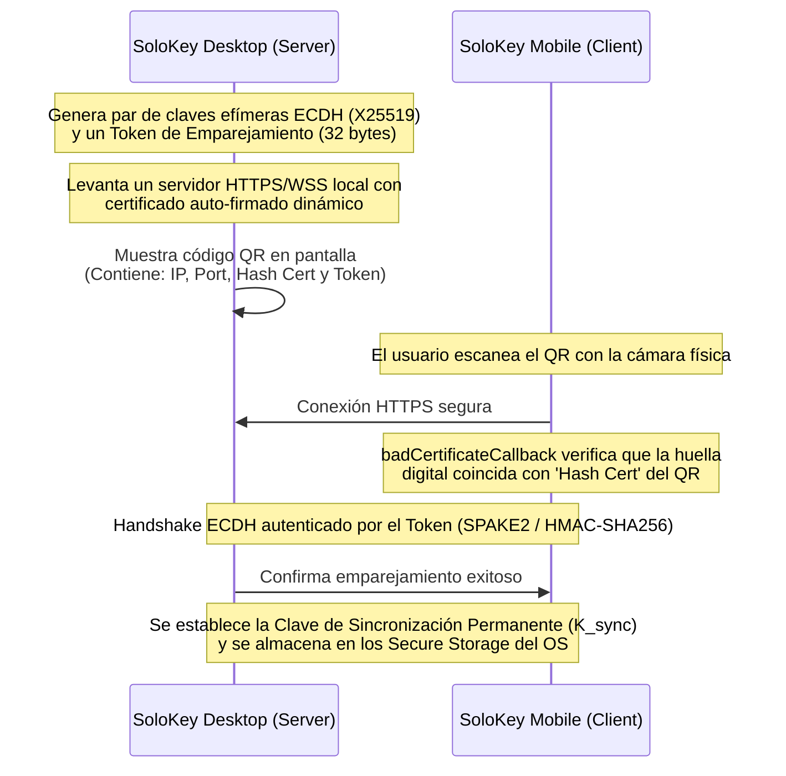

# 🖥️ SoloKey Desktop Companion — Plan Maestro de Arquitectura e Implementación

Este documento sirve como la guía técnica definitiva y el plan de implementación paso a paso para desarrollar el **SoloKey Desktop Companion** (Windows, macOS y Linux) en un chat posterior. Permite la reutilización directa de la lógica de negocio (Clean Architecture) y criptografía de la app móvil.

---

## 🏗️ 1. Arquitectura General y Stack Tecnológico

La aplicación de escritorio compartirá la base de código del proyecto móvil en Flutter (Dart), reutilizando:
*   **Dominio y Casos de Uso:** Entidades (`Credential`, `Folder`, `CustomField`), repositorios y lógica de negocio.
*   **Servicio de Criptografía (`cryptography`):** Algoritmos Argon2id y AES-256-GCM.
*   **Base de Datos (`Drift` / `SQLite`):** Modelos de persistencia local y DAOs.

### Estructura de Carpetas del Proyecto Multicanal
Para soportar el desarrollo multiplataforma limpio en el mismo repositorio, se debe organizar la estructura de la siguiente manera:

```
lib/
├── core/
│   ├── domain/               # Entidades y lógica core reutilizable
│   ├── infrastructure/
│   │   └── database/         # AppDatabase con soporte multiplataforma (Drift)
│   └── presentation/
│       ├── layouts/
│       │   └── responsive_layout.dart # Selector de Layout móvil vs escritorio
│       └── theme/            # Diseño premium común
├── features/
│   ├── credentials/          # Vistas compartidas o específicas
│   ├── folders/
│   └── sync/                 # [NUEVO] Lógica de sincronización P2P
│       ├── domain/           # Modelos de emparejamiento y sincronización
│       ├── infrastructure/   # Servidor Shelf (Escritorio) y Cliente WebSocket (Móvil)
│       └── presentation/     # Pantalla de QR (Escritorio) y Escáner (Móvil)
```

### Nuevas Dependencias Requeridas (`pubspec.yaml`)
Para el soporte nativo de escritorio, añade las siguientes dependencias al archivo `pubspec.yaml`:
```yaml
dependencies:
  # Control de ventana (tamaño, posición, centrado)
  window_manager: ^0.3.9
  # Soporte para minimizar a barra de tareas (System Tray)
  tray_manager: ^0.2.1
  # Descubrimiento de red local por ZeroConf / mDNS
  nsd: ^1.2.1
  # Servidor HTTPS / WebSocket local (para el rol de servidor en Escritorio)
  shelf: ^1.4.1
  shelf_web_socket: ^2.0.0
  shelf_router: ^1.1.4
  # Gestión de atajos de teclado y menús contextuales nativos
  context_menus: ^1.0.1
```

---

## 🔒 2. Protocolo de Emparejamiento Seguro (Pairing Key Exchange)

Establece confianza mutua entre el dispositivo móvil (cliente) y la app de escritorio (servidor local) mediante un canal autenticado por código QR y TLS Pinning:



### Detalle Técnico del QR Payload:
El código QR generado en el escritorio contiene un JSON compacto:
```json
{
  "ip": "192.168.1.45",
  "port": 8283,
  "cert_fingerprint": "a3b8cd23d8c4ef547b85e0de5876412f10b2a3cd84ef53a1b02de9c8b746a51d",
  "pairing_token": "7f8a9b2c3d4e5f6g7h8i9j0k1l2m3n4o"
}
```

#### Validación de Certificado TLS Auto-firmado en el Móvil:
Dado que el certificado TLS de la PC es auto-firmado, el cliente HTTP de Dart lo rechazará por defecto. Se implementa un bypass seguro basado en pinning de huella digital (SHA-256):
```dart
final dio = Dio(); // o HttpClient nativo
(dio.httpClientAdapter as IOHttpClientAdapter).createHttpClient = () {
  final client = HttpClient();
  client.badCertificateCallback = (X509Certificate cert, String host, int port) {
    final certFingerprint = sha256.convert(cert.der).toString();
    // Validar coincidencia exacta con el hash escaneado en el QR
    return certFingerprint == scannedFingerprintFromQR;
  };
  return client;
};
```

---

## 🔄 3. Protocolo de Sincronización Incremental (Delta-Sync)

La sincronización se realiza en tiempo real a través de WebSockets cifrados de extremo a extremo (E2EE) sobre TLS en la LAN:

1.  **Canal Cifrado Secundario:** Todo mensaje enviado por el WebSocket (payload) se encapsula en una envoltura de cifrado utilizando AES-256-GCM con la clave permanente `K_sync`. El servidor WebSocket no ve datos en claro.
2.  **Handshake de Estado:** Al conectarse, ambos dispositivos intercambian un vector de estado resumido de sus registros:
    ```json
    {
      "type": "sync_handshake",
      "payload": {
        "device_id": "desktop_uuid",
        "last_sync_timestamp": 1729482701,
        "items": [
          {"id": "cred_1", "version": 4, "updated_at": 1729482600},
          {"id": "cred_2", "version": 1, "updated_at": 1729481200}
        ]
      }
    }
    ```
3.  **Cálculo de Diferencias:**
    *   Si `version_local > version_remota`, el dispositivo envía el registro encriptado al otro.
    *   Si `version_local < version_remota`, el dispositivo solicita el registro actualizado.
4.  **Resolución de Conflictos:**
    *   Regla principal: **Last-Write-Wins (LWW)** basándose estrictamente en el timestamp `updated_at`.
    *   En caso de discrepancia menor a 1 segundo en marcas de tiempo, la versión del dispositivo móvil prevalece por defecto.

---

## 📡 4. Descubrimiento de Red Local (mDNS / ZeroConf)

El móvil descubre la instancia de escritorio en la LAN de forma transparente y sin configurar IPs estáticas:

*   **Escritorio:** Registra un servicio de red tipo `_solokey-sync._tcp` usando la librería `nsd`.
    ```dart
    final service = await register('_solokey-sync._tcp', 8283);
    ```
*   **Móvil:** Al ingresar a la sección de sincronización, inicia la resolución de red local:
    ```dart
    final discovery = await startDiscovery('_solokey-sync._tcp');
    discovery.addListener(() {
      for (final service in discovery.services) {
        // Resuelve IP y Puerto
        final ip = service.addresses.first.address;
        final port = service.port;
        // Intenta conectar de forma transparente usando K_sync guardada
      }
    });
    ```

---

## 💻 5. Almacenamiento Seguro por Sistema Operativo

Para almacenar secretos clave (`Master Password` cifrada, `K_sync`, llaves criptográficas del dispositivo) en la máquina del usuario, se utiliza `flutter_secure_storage` configurado según el sistema operativo:

*   **Windows:** Utiliza **DPAPI (Data Protection API)** a través de las credenciales del sistema de forma transparente.
*   **macOS:** Utiliza el llavero nativo **Keychain** bajo una clave de acceso única asociada al bundle ID.
*   **Linux:** Requiere la API **Secret Service** (a través de `libsecret`).
    > [!IMPORTANT]
    > **Requisito de compilación en Linux:** El entorno de desarrollo debe contar con el paquete de desarrollo del sistema:
    > `sudo apt-get install libsecret-1-dev`
    > El instalador final de la aplicación debe incluir `libsecret-1-0` como dependencia.

---

## ⏳ 6. Ciclo de Vida de la Sesión y Seguridad Extrema en Memoria

Para mitigar riesgos de seguridad física en PCs de escritorio:

### A. Auto-lock por Inactividad
Un widget `Listener` en la raíz del árbol de widgets intercepta todos los clics, movimientos de mouse y pulsaciones de teclas para mantener la sesión viva.
```dart
class AutoLockManager extends ConsumerStatefulWidget {
  final Widget child;
  const AutoLockManager({super.key, required this.child});

  @override
  ConsumerState<AutoLockManager> createState() => _AutoLockManagerState();
}

class _AutoLockManagerState extends ConsumerState<AutoLockManager> {
  Timer? _timer;

  void _resetTimer() {
    _timer?.cancel();
    final timeoutSeconds = ref.read(settingsProvider).autoLockTimeout;
    _timer = Timer(Duration(seconds: timeoutSeconds), () {
      ref.read(vaultStateProvider.notifier).lockVault();
    });
  }

  @override
  Widget build(BuildContext context) {
    return Listener(
      onPointerDown: (_) => _resetTimer(),
      onPointerMove: (_) => _resetTimer(),
      child: KeyboardListener(
        focusNode: FocusNode()..requestFocus(),
        onKeyEvent: (_) => _resetTimer(),
        child: widget.child,
      ),
    );
  }
}
```

### B. Borrado Seguro de Memoria (RAM Zeroing)
Dart no garantiza la eliminación inmediata de objetos `String` o `List` en la heap debido a la inmutabilidad de strings y el recolector de basura (GC). Para mitigar fugas de memoria Heap:
1.  **Claves Maestras en Arrays Mutables:** Las claves derivadas de Argon2id y AES se representan y procesan estrictamente como `Uint8List`.
2.  **Limpieza Activa:** Inmediatamente después de descifrar la base de datos o validar el login, se invoca `fillRange` sobre la lista para sobrescribirla con ceros:
    ```dart
    void zeroBuffer(Uint8List buffer) {
      buffer.fillRange(0, buffer.length, 0);
    }
    ```

### C. Ocultación y Cierre Inteligente (Bandeja de Sistema)
*   **Minimizar a Tray al Cerrar:** Al presionar la `X` de la ventana, la aplicación intercepta el evento de cierre, oculta la ventana principal mediante `windowManager.hide()` y muestra un icono en la bandeja del sistema (System Tray).
*   **Bloqueo Automático en Tray:** Si la ventana permanece minimizada al Tray por más de 5 minutos, la sesión se bloquea de forma preventiva.

---

## 📲 7. Desbloqueo Remoto Cifrado (WiFi Unlock)

Permite al usuario desbloquear la bóveda de la aplicación de escritorio de manera segura usando la biometría (FaceID/TouchID) de su teléfono móvil:

1.  **Escenario:** El escritorio está en la pantalla de bloqueo.
2.  **Detección:** El móvil se conecta automáticamente vía WebSocket local tras resolver la red por mDNS.
3.  **Petición de Desbloqueo:** El escritorio envía un evento `challenge` al móvil.
4.  **Confirmación Biométrica:** El móvil solicita FaceID/TouchID al usuario.
5.  **Envío Cifrado:** Si la biometría es exitosa, el móvil recupera la `Master Password` de su llavero local, la cifra con la clave efímera derivada de `K_sync` más un vector de inicialización (IV) de un solo uso, y la transmite.
6.  **Desbloqueo:** El escritorio descifra el payload, valida la contraseña maestra levantando la DB y desbloquea la UI. La contraseña se borra inmediatamente de la memoria del escritorio mediante RAM Zeroing.

---

## 🎨 8. Interfaz de Usuario de Escritorio (Premium UI/UX)

Para lograr un acabado sumamente sofisticado y profesional (Diseño "WOW" Premium):

*   **Responsive Master-Detail:**
    *   Pantallas anchas (`>720px`): Sidebar colapsable de navegación, lista de credenciales en columna intermedia (`350px`) y panel detallado de credencial a la derecha ocupando el espacio restante.
    *   Pantallas estrechas (`<720px`): Navegación lineal en pila (idéntica a la vista móvil).
*   **Atajos de Teclado Nativos:**
    *   `Ctrl + F` / `Cmd + F`: Enfocar barra de búsqueda inmediatamente.
    *   `Ctrl + N` / `Cmd + N`: Abrir formulario para agregar una nueva credencial.
    *   `Ctrl + L` / `Cmd + L`: Bloquear bóveda al instante.
    *   `Esc`: Limpiar la selección de credencial actual o cerrar modales.
*   **Menús Contextuales Flotantes (Click Derecho):**
    *   Sobre credenciales en la lista: "Copiar usuario", "Copiar contraseña", "Editar", "Eliminar", "Copiar clave SSH (si aplica)".
*   **Micro-animaciones de Feedback:**
    *   Copia exitosa al portapapeles: Animación de checkmark verde con micro-rebote (Spring Animation) y difuminado suave del tooltip.
    *   Efecto de transición tipo Slide & Fade al seleccionar credenciales de la lista.

---

## 🛠️ 9. Plan de Trabajo Paso a Paso (Checklist Definitivo)

Este checklist detalla las tareas específicas a ejecutar en un chat de desarrollo posterior:

### 🟩 Fase 1: Habilitación de Plataformas y Ventana Nativa
- [ ] Correr el comando de inicialización de plataformas de escritorio:
  ```bash
  flutter create --platforms=windows,macos,linux .
  ```
- [ ] Configurar dependencias en `pubspec.yaml` e instalar (`flutter pub get`).
- [ ] Modificar `lib/main.dart` para inicializar y forzar tamaños en `window_manager`:
  ```dart
  WidgetsFlutterBinding.ensureInitialized();
  await windowManager.ensureInitialized();
  
  WindowOptions windowOptions = const WindowOptions(
    size: Size(1080, 780),
    minimumSize: Size(850, 650),
    center: true,
    title: "SoloKey Secure Vault",
    titleBarStyle: TitleBarStyle.normal,
  );
  
  windowManager.waitUntilReadyToShow(windowOptions, () async {
    await windowManager.show();
    await windowManager.focus();
  });
  ```
- [ ] Crear el widget selector de layout responsivo: `ResponsiveLayout` basado en `MediaQuery` o `LayoutBuilder`.

### 🟦 Fase 2: Soporte de Bandeja del Sistema y Ciclo de Vida
- [ ] Registrar el System Tray usando `tray_manager` e implementar menús básicos (Desbloquear, Bloquear, Salir).
- [ ] Modificar el manejador nativo del ciclo de vida de Flutter para interceptar el botón cerrar (`X` de la ventana) y llamar a `windowManager.hide()`.
- [ ] Implementar el widget `AutoLockManager` en la raíz del árbol para monitorear eventos globales del mouse y teclado.
- [ ] Escribir el método `zeroBuffer` en `lib/core/domain/crypto_utils.dart` para limpiar arreglos de bytes de claves AES.

### 🟨 Fase 3: Servidor P2P, mDNS y Emparejamiento QR
- [ ] Configurar el descubrimiento de red local en escritorio con `nsd` registrando el socket local bajo el tipo `_solokey-sync._tcp`.
- [ ] Implementar el servidor Shelf en la aplicación de escritorio que levante un socket seguro en un puerto libre aleatorio.
- [ ] Añadir generación de certificados auto-firmados rápidos y extracción de su huella digital SHA-256.
- [ ] Desarrollar la UI del código QR en el escritorio con el JSON de configuración para emparejamiento.
- [ ] Agregar el escáner de QR en la aplicación móvil con `mobile_scanner` y configurar el bypass seguro de TLS Pinning.
- [ ] Programar el intercambio de claves ECDH X25519 autenticado por PIN/Token para acordar `K_sync`.

### 🟪 Fase 4: Sincronización Delta-Sync y Desbloqueo WiFi
- [ ] Implementar el canal WebSocket encriptado con AES-256-GCM usando la clave permanente `K_sync`.
- [ ] Construir la lógica de cálculo de diferencias (Deltas) en Drift, comparando versiones e instantes de modificación.
- [ ] Implementar la regla de conflicto Last-Write-Wins (LWW) en la base de datos local.
- [ ] Integrar el mecanismo de Desbloqueo Remoto: Pantalla de bloqueo del escritorio a la espera de confirmación y desencriptación por biometría móvil.
- [ ] Validar compatibilidad completa en las tres plataformas ejecutando:
  ```bash
  # Windows
  flutter run -d windows
  
  # macOS
  flutter run -d macos
  
  # Linux
  flutter run -d linux
  ```
- [ ] Ejecutar el análisis y suite de pruebas para certificar la consistencia criptográfica:
  ```bash
  flutter analyze
  flutter test
  ```
